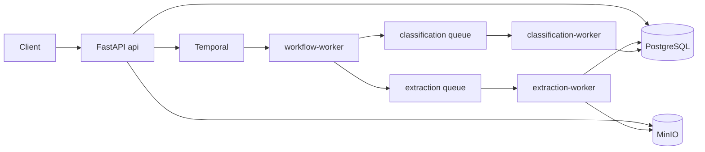

# Document Pipeline POC

## 1. Project overview

This is a local proof of concept for a two-stage document-processing pipeline. The API
accepts document text, stores the immutable source in MinIO, creates a versioned run in
PostgreSQL, and starts a Temporal workflow. Extraction stores entity candidates as token
rows. Classification then labels each token as `COMPANY`, `PERSON`, `ADDRESS`, `DATE`, or
`UNKNOWN`.

The mock NLP and classifier adapters are deterministic and require no API keys.

## 2. Architecture summary



The services run separately: `api`, `workflow-worker`, `extraction-worker`, and
`classification-worker`. They share one image but use separate commands and Temporal task
queues.

## 3. Why Temporal, PostgreSQL, and MinIO

Temporal owns workflow execution, retries, and recovery. PostgreSQL owns business state:
documents, runs, chunks, tokens, batches, counters, and active-run publication. MinIO owns
source and derived chunk content so Temporal payloads carry only IDs.

## 4. Repository structure

The package is under `src/document_pipeline`. Important layers are `api/controllers`,
`api/validations`, `models`, `repositories`, `services`, `integrations`, `workflows`, and
`workers`.

## 5. Prerequisites

Install Docker, Docker Compose, `curl`, `jq`, and `uv` for local quality commands.

## 6. Quick start

```bash
cp .env.example .env
./start.sh
```

OpenAPI: `http://localhost:8080/docs`  
Temporal UI: `http://localhost:8088`  
MinIO UI: `http://localhost:9001`

## 7. Configuration

All runtime settings are environment variables documented in `.env.example`, including
database URL, Temporal queues, S3/MinIO credentials, source-size limit, chunk size,
overlap, batch size, worker concurrency, and mock provider delays.

## 8. API examples

```bash
curl -X POST http://localhost:8080/process \
  -H 'Content-Type: application/json' \
  -d '{"document_id":"doc-123","text":"John Smith works at Acme Corp, located at 123 Main St."}'

curl http://localhost:8080/documents/doc-123/status

curl 'http://localhost:8080/documents/doc-123/tokens?classification=PERSON'
```

Full rerun:

```bash
curl -X POST http://localhost:8080/api/v1/documents/doc-123/rerun \
  -H 'Content-Type: application/json' \
  -d '{"text":"Jane Doe joined Contoso LLC at 800 Pine Street on 2026-06-15.","reuse_source":false}'
```

## 9. Processing lifecycle

Processing creates a source object and PENDING run, starts
`DocumentProcessingWorkflow(run_id)`, creates deterministic chunks, runs extraction
activities, finalizes exact `total_tokens`, creates stable classification batches, runs
classification activities, finalizes the run, and then atomically publishes
`documents.active_run_id`.

## 10. Partial recovery

Extraction checkpoints at chunk completion. Classification persists each token result in
small transactions. Retried activities skip completed chunks, batches, and tokens, and
`classified_tokens` increments only when a token transitions to `COMPLETED`.

## 11. Full rerun semantics

Reruns create a new isolated run version. Old active tokens remain readable while the new
run processes. The active pointer changes only after the new run reaches `COMPLETED`.

## 12. Progress and duration tracking

Status includes top-level `processed_tokens`, extraction chunk progress, classification
token progress, persisted stage timestamps, and finalized wall-clock durations in
milliseconds.

## 13. NLP and classifier interfaces

`Extractor` and `Classifier` are provider-neutral protocols. `MockExtractor` detects
people, organizations, addresses, dates, and selected locations. `MockClassifier` maps
tokens deterministically with confidence and concise reasoning.

## 14. Test documents

`test_documents/small.txt`, `medium.txt`, and `large.txt` contain original business-style
sample content. `scripts/generate_large_document.py` recreates the large file
deterministically.

## 15. Running tests and quality checks

```bash
uv run ruff check .
uv run ruff format --check .
uv run mypy src
uv run pytest
```

Useful make targets:

```bash
make up
make down
make logs
make migrate
make test
make integration-test
make lint
```

`make integration-test` starts or refreshes the Docker Compose stack, opts into the
compose-backed tests, disables local coverage for those tests, and prints each integration
test name as it runs.

## 16. Demo walkthrough

Run:

```bash
make demo
```

The script prints phase banners as it starts the stack, runs the small-document happy
path, shows large-document classification progress, stops and restarts the classification
worker for recovery, performs a full rerun, submits small/medium/large documents
concurrently, and runs filtered token queries for each document size.

## 17. Failure handling and retry behavior

Domain errors map to stable JSON error responses. Temporal activities use retry policies.
Temporary infrastructure failures are retried by Temporal. Deterministic data errors are
recorded as failed runs with sanitized error details.

## 18. Known trade-offs and production follow-ups

Extraction must complete before classification, which simplifies exact progress but
increases latency. Bounded chunks need overlap and canonical ownership to handle
cross-boundary entities. Temporal provides durable orchestration but adds another local
service. Mock NLP/LLM behavior demonstrates interfaces, not production model quality.
Exactly-once external classifier execution is not guaranteed, while persistence is
idempotent. JSON text input is assignment-compatible; true very-large uploads would
normally use multipart upload or pre-signed object upload. Authentication is out of scope
for this POC and would be required in production.

## 19. AI-assisted development evidence

Prompt and review notes are under `docs/ai`. Generated code was reviewed against the
assignment constraints and remains the submitter's responsibility.
